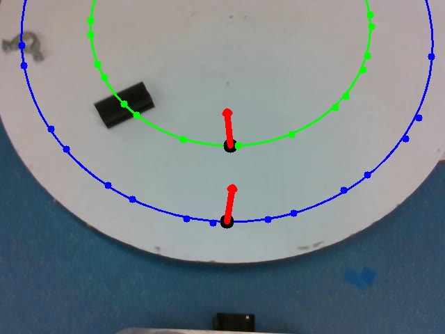
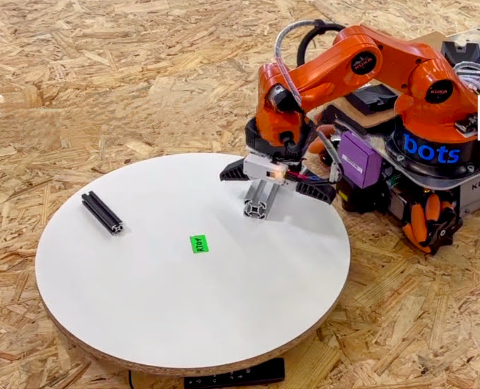

# mir_rtt_detection


- In the Advanced Transportation Task 2 and final, the robot is required to pick up an object from a rotating table.
- In our current approach, object detection is performed using YOLOv8 on a sequence of 15 frames from the camera.
- Centroids and orientations for the target object are transformed to the robot's base frame for all images, and stored along with their timestamps.
- A circular model is fit to the sequence of centroids and used to estimate the direction and rotation speed of the rotating table.
- To measure the accuracy of the estimated radius and rotation speed, we used four objects (S40_40_B, M20, Housing, and AllenKey) at eight radii (32 to 46 cm in 2 cm increments), yielding 32 readings.
- We found a Mean Absolute Error (MAE) of 5 mm for the estimated radius and 6 * 10<sup>-3</sup> rad/sec for rotational speed, compared to the ground truth, which was estimated by manually measuring the time for 10 rotations.
- The point on the circle that is closest to the robot is chosen as the grasp position, and the predicted time when the object will reach the selected location is determined by taking into account the last known position of the object and the rotation speed of the table.


<div style="display:flex;">
    
    
</div>


## Usage

- Launch the bringup
  ```
  roslaunch mir_bringup robot.launch
  ```

- Launch planning bringup
  ```
  roslaunch mir_planning_bringup robot.launch
  ```

- Run the client from 
  ```
  rosrun mir_rtt_pick_object rtt_pick_object_client_test.py [obj_name] [workstation_name]
  Example - rosrun mir_rtt_pick_object rtt_pick_object_client_test.py S40_40_B TT01
  ```

## Topics

### In
- `/mir_perception/rtt/event_in`
- `/tower_cam3d_front/color/image_raw`
- `/tower_cam3d_front/depth/color/points`

### Out
- `/mir_perception/rtt/event_out`
- `/mir_perception/mir_rtt_detector/predicted_object_pose`
- `/mir_perception/rtt/time_stamped_pose`
- `/mir_perception/multimodal_object_recognition/recognizer/rgb/output/debug_image`

